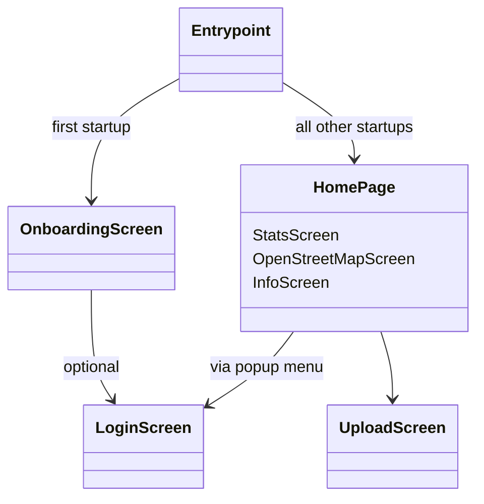

# The Big Solar Hunt

<!-- ALL-CONTRIBUTORS-BADGE:START - Do not remove or modify this section -->
[](#contributors-)
<!-- ALL-CONTRIBUTORS-BADGE:END -->

Flutter frontend for The Big Solar Hunt Android/IOS app, a collaborative project between
[Open Climate Fix](https://openclimatefix.org/) and [Possible](https://www.wearepossible.org/).

- [The Big Solar Hunt](#the-big-solar-hunt)
  - [Installing Flutter](#installing-flutter)
  - [Repository Structure](#repository-structure)
  - [Application Navigational Flow](#application-navigational-flow)
  - [Database Structure](#database-structure)
    - [userPanels table](#userpanels-table)
    - [userBadges table](#userbadges-table)
  - [Building the appbundle](#building-the-appbundle)
    - [Remotely](#remotely)
    - [Locally (not recommended)](#locally-not-recommended)
      - [Keystore and key.properties](#keystore-and-keyproperties)
      - [Environment variables and config.dart](#environment-variables-and-configdart)
      - [Build command](#build-command)
  - [Next Steps](#next-steps)
    - [1. Transition to GitHub (`TODO`)](#1-transition-to-github-todo)
    - [2. AWS Service (`TODO`)](#2-aws-service-todo)
  - [Contributors](#contributors)

## Installing Flutter

For help getting started with Flutter, [view the
online documentation](https://flutter.dev/docs), which offers tutorials, samples, guidance on
mobile development, and a full API reference.

- Set up with VSCode: https://flutter.dev/docs/get-started/editor?tab=vscode
- Set up with Android Studio: https://flutter.dev/docs/get-started/editor?tab=androidstudio
- Run the app: https://flutter.dev/docs/get-started/test-drive?tab=vscode

## Repository Structure

The repository has at the top level the default flutter folder structure.
For more information on the purposes of each folder, see
[this link](https://www.section.io/engineering-education/flutter-folder-organization/).

Within the `lib` folder is the application code itself. Internally, this folder is laid out as
follows:

```yaml
lib
- main.dart # This is the entrypoint of the application. Defines top level named navigation routes
- home_page.dart # Defines the main screen of the application
- Animation/ # Files pertaining to widget animation
- Config/ # Defines environment variables used for API tokens and other secrets
- DataStructs/ # Class definitions for the Badge and SolarPanel data structures
- Screens/ # All screens of tha application, arranged into folders
- Services/ # Files containing utility functions for e.g. handling databases and connectivity checks
- Themes/ # Defines the colour palettes for the applications' light and dark themes
```

`Screens` are used in this repository to refer to a full page view of the application. These are
sometimes referred to as `Routes`,`Views` or `Pages` in other applications and online documentation.
A `Screen` folder has the following structure:

```yaml
ExampleScreen
- ExampleScreenWidgets/
- example_screen.dart
```

The `ExampleScreenWidgets` folder contains definitions of sub-widgets to the ExampleScreen widget.
This helps to keep each Screen's code compartmentalized, and keeps each widget's file more readable.

## Application Navigational Flow

The App's navigation is laid out so that the user can access the upload screen from any of the
sub-screens on the Home Screen. The flow looks as follows:



An upload to Mapillary (or telegram/AWS) can be triggered by the user from two points in the app:

- A single-image upload from the
  UploadButton `lib/Screens/UploadScreen/UploadScreenWidgets/UploadBodyWidgets/upload_button.dart`
- A multiple image of **queued** images from the PopupMenuButton (options menu), via
  the`handleOptionsClick` function in `lib/home_page.dart`. Queued images are those that were taken,
  but could not be uploaded due to a lack of internet connection or a failure on the client side.
  They are identified in the `userPanels` table via a 0 in the `uploaded` column (see "Database
  Structure" below).

## Database Structure

### userPanels table

| Column Name | Type  | Description                                                                 |
| ----------- | ----- | --------------------------------------------------------------------------- |
| id          | int   | Autoincremented integer, unique to each panel                               |
| lat         | float | Latitude in degrees                                                         |
| lon         | float | Longitude in degrees                                                        |
| path        | text  | Filepath of the panel image                                                 |
| date        | text  | ISO-6801 string representation of the datetime at which the photo was taken |
| uploaded    | int   | 1 if panel has been uploaded, 0 otherwise                                   |

See `lib/DataStructs/solar_panel.dart` for container/converter class.

### userBadges table

| Column Name  | Type | Description                                                                 |
| ------------ | ---- | --------------------------------------------------------------------------- |
| id           | text | Badge text id, unique to each badge                                         |
| imagePath    | text | Path to badge image asset                                                   |
| panelCount   | int  | Number of panels required to unlock, NULL if not applicable                 |
| unlocked     | int  | 1 if panel has been unlocked, 0 otherwise                                   |
| dateUnlocked | text | ISO-6801 string representation of the datetime at which the photo was taken |
| description  | text | Text description of the requirements for unlocking the badge                |

See `lib/DataStructs/badge.dart` for container/converter class, as well as table initialisation.

## Building the appbundle

### Remotely

The appbundle is built automatically when new commits are made to master via the gitlab pipeline
outlined in `.gitlab-ci.yml`. The built bundle can then be accessed from the `artifacts` section of
the ci pipeline. For more information on Gitlab CI Pipelines, see the following links.

- Quick overview: https://about.gitlab.com/blog/2019/07/12/guide-to-ci-cd-pipelines/
- Pipelines specifics: https://docs.gitlab.com/ee/ci/pipelines/
- How to structure a ci pipeline: https://docs.gitlab.com/ee/ci/yaml/gitlab_ci_yaml.html

### Locally (not recommended)

To build a release appbundle locally, the process to be followed is functionally the same as that
outlined in the `gitlab-ci.yml` pipeline.

#### Keystore and key.properties

To sign the appbundle, a **keystore** is required, the value of which can be found in the Gitlab CI
variables. Then, `android/key.properties` must be defined as can be seen in the
build-debug-android `gitlab-ci.yml` pipeline, with the following structure:

```txt
storePassword=password_of_the_keystore
keyPassword=password_of_the_key
keyAlias=key
storeFile=/path/to/your/keystore/file.jks
```

#### Environment variables and config.dart

To prevent the requirement of checking secrets into version control, things like the Mapillary API
key and the Telegram Bot token are passed into the app dynamically at build time. These variables
are defined in the `Env` class in `lib/Config/config.dart`, and are passed to flutter at build time
via the command flag `--dart-define`, see an
example [here](https://dartcode.org/docs/using-dart-define-in-flutter/).

#### Build command

The appbundle can then be built via

```shell
$ flutter build appbundle \
      --release \
      --build-name=1.2.${CI_PIPELINE_IID} \
      --build-number=${CI_PIPELINE_IID} \
      --dart-define=MAPILLARY_BEARER_TOKEN=${MAPILLARY_BEARER_TOKEN} \
      --dart-define=MAPILLARY_CLIENT_ID=${MAPILLARY_CLIENT_ID} \
      --dart-define=TELEGRAM_BOT_TOKEN=${TELEGRAM_BOT_TOKEN} \
      --dart-define=TELEGRAM_CHAT_ID=${TELEGRAM_CHAT_ID}
```

If you see the following exception:

```shell
Flutter SDK not found. Define location with flutter.sdk in the local.properties file.
```

create a `android/local.properties` file, with the following structure:

```txt
flutter.sdk=/path/to/flutter/instance
sdk.dir=/path/to/android/sdk
flutter.buildMode=debug
flutter.versionName=flutter.version.name
flutter.versionCode=1
```

---

## Next Steps

There are two main tasks to be done for the app to see a stable release:

- [ ] Transition to GitHub
- [ ] Swap telegram service to AWS storage bucket service

### 1. Transition to GitHub (`TODO`)

To move the service to OCF's GitHub, the `gitlab-ci.yml` pipeline must be rewritten as a GitHub
Actions job. This will in turn require the environment variables found in
GitLab's `settings -> CI/CD -> Variables` to be moved to the GitHub project-level variables.

### 2. AWS Service (`TODO`)

Currently an upload call invokes functions that communicate to telegram, defined
in `lib/Services/telegram_service.dart`. If the decision is that the images are to be moved to an
AWS storage bucket,
`lib/Services/mapillary_service.dart` and `lib/Services/telegram_service.dart` can be removed, and
replaced with a new
`lib/Services/aws_service.dart`, which will define both an `upload` and an `uploadQueuedPanels`
function that can upload an image or set of images to the bucket. This service can then be imported
and its upload functions called in the two places a user can trigger an upload (see the "Application
Navigational Flow" section).

## Contributors

<!-- ALL-CONTRIBUTORS-LIST:START - Do not remove or modify this section -->
<!-- prettier-ignore-start -->
<!-- markdownlint-disable -->
<table>
  <tr>
    <td align="center"><a href="https://gitlab.com/solomoncotton"><br /><sub><b>Sol Cotton</b></sub></a><br /><a href="https://github.com/openclimatefix/bigsolarhunt/commits?author=solomoncotton" title="Code">💻</a> <a href="#content-solomoncotton" title="Content">🖋</a> <a href="https://github.com/openclimatefix/bigsolarhunt/commits?author=solomoncotton" title="Documentation">📖</a> <a href="#design-solomoncotton" title="Design">🎨</a> <a href="#ideas-solomoncotton" title="Ideas, Planning, & Feedback">🤔</a></td>
    <td align="center"><a href="https://github.com/mukhikaran"><br /><sub><b>Karan Mukhi</b></sub></a><br /><a href="https://github.com/openclimatefix/bigsolarhunt/commits?author=mukhikaran" title="Code">💻</a> <a href="#content-mukhikaran" title="Content">🖋</a> <a href="https://github.com/openclimatefix/bigsolarhunt/commits?author=mukhikaran" title="Documentation">📖</a> <a href="#design-mukhikaran" title="Design">🎨</a> <a href="#ideas-mukhikaran" title="Ideas, Planning, & Feedback">🤔</a></td>
    <td align="center"><a href="https://github.com/danstowell"><br /><sub><b>Dan Stowell</b></sub></a><br /><a href="#projectManagement-danstowell" title="Project Management">📆</a> <a href="#ideas-danstowell" title="Ideas, Planning, & Feedback">🤔</a> <a href="#content-danstowell" title="Content">🖋</a></td>
    <td align="center"><a href="https://gitlab.com/schmidt_fu"><br /><sub><b>Florian Schmidt</b></sub></a><br /><a href="https://github.com/openclimatefix/bigsolarhunt/commits?author=schmidt_fu" title="Code">💻</a></td>
    <td align="center"><a href="https://github.com/Rabscuttler"><br /><sub><b>Laurence Watson</b></sub></a><br /><a href="#ideas-Rabscuttler" title="Ideas, Planning, & Feedback">🤔</a></td>
  </tr>
  <tr>
    <td align="center"><a href="https://github.com/flowirtz"><br /><sub><b>Flo Wirtz</b></sub></a><br /><a href="#maintenance-flowirtz" title="Maintenance">🚧</a></td>
  </tr>
</table>

<!-- markdownlint-restore -->
<!-- prettier-ignore-end -->

<!-- ALL-CONTRIBUTORS-LIST:END -->
