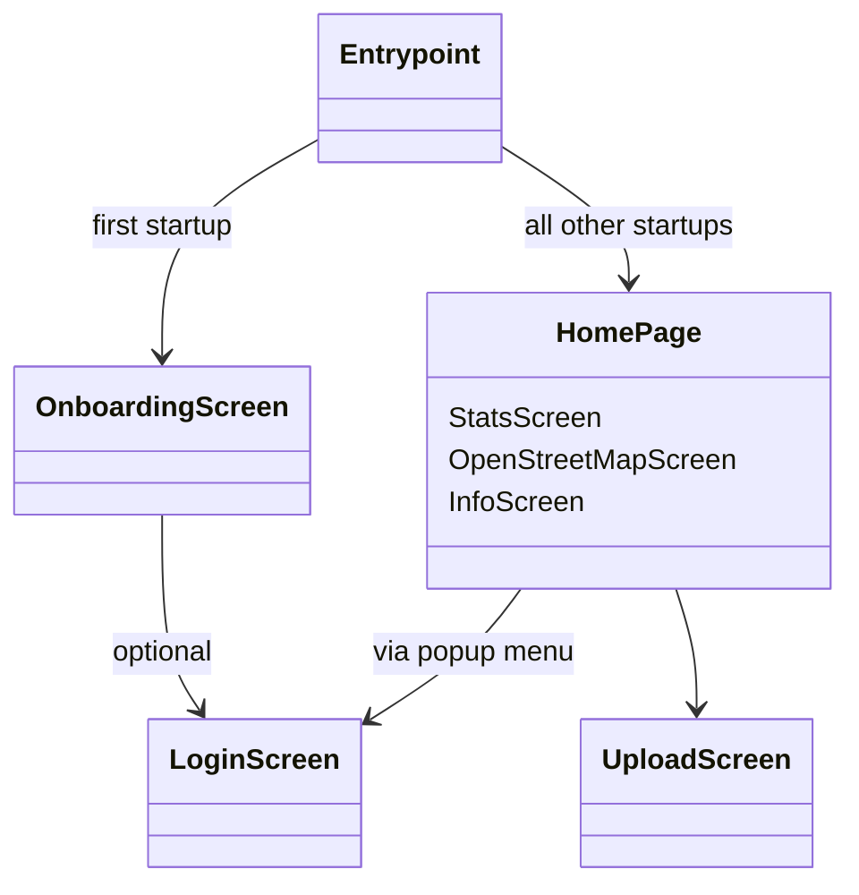

# Overview

- [Overview](#overview)
  - [Repository Structure](#repository-structure)
  - [Application Navigational Flow](#application-navigational-flow)
  - [Database Structure](#database-structure)
    - [userPanels table](#userpanels-table)
    - [userBadges table](#userbadges-table)

## Repository Structure

The repository has at the top level the default flutter folder structure.
For more information on the purposes of each folder, see
[this link](https://www.section.io/engineering-education/flutter-folder-organization/).

Within the `lib` folder is the application code itself. Internally, this folder is laid out as
follows:

```yaml
lib
- main.dart # This is the entrypoint of the application. Defines top level named navigation routes
- home_page.dart # Defines the main screen of the application
- Animation/ # Files pertaining to widget animation
- Config/ # Defines environment variables used for API tokens and other secrets
- DataStructs/ # Class definitions for the Badge and SolarPanel data structures
- Screens/ # All screens of tha application, arranged into folders
- Services/ # Files containing utility functions for e.g. handling databases and connectivity checks
- Themes/ # Defines the colour palettes for the applications' light and dark themes
```

`Screens` are used in this repository to refer to a full page view of the application. These are
sometimes referred to as `Routes`,`Views` or `Pages` in other applications and online documentation.
A `Screen` folder has the following structure:

```yaml
ExampleScreen
- ExampleScreenWidgets/
- example_screen.dart
```

The `ExampleScreenWidgets` folder contains definitions of sub-widgets to the ExampleScreen widget.
This helps to keep each Screen's code compartmentalized, and keeps each widget's file more readable.

## Application Navigational Flow

The App's navigation is laid out so that the user can access the upload screen from any of the
sub-screens on the Home Screen. The flow looks as follows:



An upload to Mapillary (or telegram/AWS) can be triggered by the user from two points in the app:

- A single-image upload from the
  UploadButton `lib/Screens/UploadScreen/UploadScreenWidgets/UploadBodyWidgets/upload_button.dart`
- A multiple image of **queued** images from the PopupMenuButton (options menu), via
  the`handleOptionsClick` function in `lib/home_page.dart`. Queued images are those that were taken,
  but could not be uploaded due to a lack of internet connection or a failure on the client side.
  They are identified in the `userPanels` table via a 0 in the `uploaded` column (see "Database
  Structure" below).

## Database Structure

### userPanels table

| Column Name | Type  | Description                                                                 |
| ----------- | ----- | --------------------------------------------------------------------------- |
| id          | int   | Autoincremented integer, unique to each panel                               |
| lat         | float | Latitude in degrees                                                         |
| lon         | float | Longitude in degrees                                                        |
| path        | text  | Filepath of the panel image                                                 |
| date        | text  | ISO-6801 string representation of the datetime at which the photo was taken |
| uploaded    | int   | 1 if panel has been uploaded, 0 otherwise                                   |

See `lib/DataStructs/solar_panel.dart` for container/converter class.

### userBadges table

| Column Name  | Type | Description                                                                 |
| ------------ | ---- | --------------------------------------------------------------------------- |
| id           | text | Badge text id, unique to each badge                                         |
| imagePath    | text | Path to badge image asset                                                   |
| panelCount   | int  | Number of panels required to unlock, NULL if not applicable                 |
| unlocked     | int  | 1 if panel has been unlocked, 0 otherwise                                   |
| dateUnlocked | text | ISO-6801 string representation of the datetime at which the photo was taken |
| description  | text | Text description of the requirements for unlocking the badge                |

See `lib/DataStructs/badge.dart` for container/converter class, as well as table initialisation.
